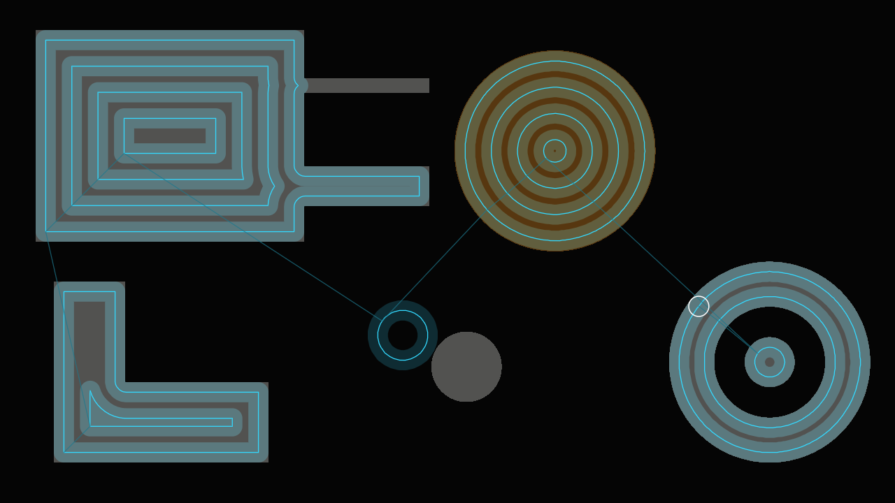
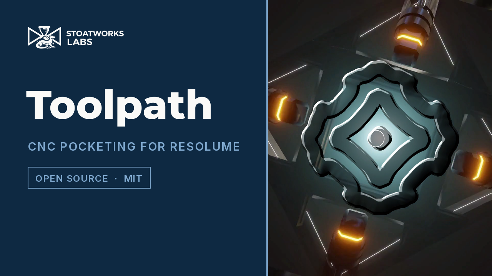

# toolpath

> **AI-assisted project.** This codebase was created with [Claude](https://claude.com/claude-code)
> (Anthropic), directed and reviewed by a human author. The machining is not
> asserted but measured: an offline harness drives the real plugin class in a
> headless GL context and reads each claim back out of the plugin's own field or
> out of the picture — the jump-flooded distance field, computed on a lattice of
> two pixels a texel, is exact to 6 ULP on rectilinear shapes and within √2
> texels (2.83 px) of an exact Euclidean distance transform on curved ones, a
> square pocket's inside corners keep a fillet whose radius reads back within
> 0.02 px of the tool's, a slot 2 px narrower than the tool is never entered and
> one 5 px wider is cut end to end, a stepover past the tool's diameter leaves
> ridges s − 2r wide to within 0.15 px, and the tool covers exactly Feed pixels
> of path a second at 60 and at 30 fps — with eight negative controls that prove
> each check can fail, one of them that the reduced field is the one in use. It has **never been loaded into Resolume on macOS**; on Windows it passed the
> fleet Arena gate. On macOS it is loaded by [oxbow](https://github.com/stoatworks-labs/oxbow),
> which is a real FFGL host and is not Resolume. See [Status](#status).

CNC pocketing from a distance field, as an FFGL effect for
[Resolume](https://resolume.com) Arena and Avenue.


<sub>One frame, rendered by `tptest`, the offline harness — not captured from
Resolume. Engrave mode, the stepover at 1.3 tool diameters so the ridges show,
six and a half seconds into the job.</sub>

<!-- downloads:start -->

## Download

**[v0.1.0](https://github.com/stoatworks-labs/toolpath/releases/tag/v0.1.0)** — prebuilt for macOS and Windows. Pick your platform:

<details>
<summary><b>macOS</b> — Universal (Apple Silicon + Intel)</summary>

| Build | Download | Size |
| --- | --- | --- |
| Universal (Apple Silicon + Intel) · .dmg disk image | [`toolpath-0.1.0-macos-universal.dmg`](https://github.com/stoatworks-labs/toolpath/releases/download/v0.1.0/toolpath-0.1.0-macos-universal.dmg) | 255 KB |
| Universal (Apple Silicon + Intel) · .zip archive | [`toolpath-macos-universal.zip`](https://github.com/stoatworks-labs/toolpath/releases/latest/download/toolpath-macos-universal.zip) | 215 KB |

</details>

<details>
<summary><b>Windows</b> — x64</summary>

| Build | Download | Size |
| --- | --- | --- |
| x64 · .exe installer | [`toolpath-0.1.0-windows-x86_64-setup.exe`](https://github.com/stoatworks-labs/toolpath/releases/download/v0.1.0/toolpath-0.1.0-windows-x86_64-setup.exe) | 236 KB |
| x64 · .zip archive | [`toolpath-windows-x86_64.zip`](https://github.com/stoatworks-labs/toolpath/releases/latest/download/toolpath-windows-x86_64.zip) | 131 KB |

</details>

All builds, checksums and release notes: [github.com/stoatworks-labs/toolpath/releases](https://github.com/stoatworks-labs/toolpath/releases).

macOS builds are signed and notarised and open normally. The Windows builds are unsigned, so SmartScreen warns once.

<!-- downloads:end -->

## The one idea

A CNC router clears a pocket with a round tool. The tool's centre can only go
where the whole disc fits, and what it removes is everywhere the disc has been:
in morphology, the pocket **opened** by a disc of the tool's radius. The path
that does it is a set of offset contours of the pocket — the level sets of its
**distance field** at r, r + s, r + 2s … for tool radius r and stepover s.

So one distance field is the whole CAM job. The bright part of the clip is the
pocket; its field comes from jump flooding on the GPU; the offset levels are
traced into ordered paths on the CPU; and a tool runs along them at a feed rate,
stamping its disc into a cut buffer that persists. The cut buffer is the part.



<sub>`Mode: Paths` — the job itself: every pass, the rapids between pockets, the
tool.</sub>

## What falls out

None of these is drawn. Each is the geometry doing what it does:

- **Inside corners keep a fillet of exactly the tool's radius.** The first pass
  runs r in from each wall and meets itself at a corner r in from both; the disc
  there reaches a quarter circle of radius r and no further.
- **A slot narrower than the tool is never entered.** Inside a slot w wide the
  field never exceeds w/2, so where w < 2r there is no level r to trace.
- **A stepover wider than the tool leaves scallops.** Each pass cuts a band 2r
  wide; past s = 2r the bands stop touching and ridges of stock s − 2r wide stand
  between them.
- **A big pocket takes longer than a small one.** The tool moves at `Feed`, and a
  big pocket is more path.

The same field gives a glow, a bevel and an outline at a distance for free:
`Mode: Field`.

### The honest limit

The pocket is a threshold of the picture taken on a lattice of **two pixels a
texel**: a texel is pocket when more than half of its 2×2 block is. So its walls
are two-pixel steps, a wall that falls half way across a block moves a pixel in
(never out), and anything narrower than the lattice — a one-pixel line, a single
pixel — is not seen at all. The field is measured between texel centres, and the
flood is not an exact distance transform: it is exact on straight walls and
within √2 texels (2.83 px) on curves. Computing it on that lattice rather than
the full raster is what takes Live at 4K from 16 ms a frame to 9. The trace is
on a grid of at most 1280 samples across, so above 1280 wide a pass is placed to
within one sample of a coarser grid. There is one tool, one depth, no ramping or plunging,
no climb-or-conventional choice, and no finishing pass along the medial axis, so
a pocket whose last pass falls short of its middle keeps an island there, as a
real job without a cleanup pass would.

[](https://www.youtube.com/watch?v=awPH12ObwPU)

*[Watch it](https://www.youtube.com/watch?v=awPH12ObwPU) — 51 seconds:
Latch clearing a clip's bright shapes outside in, Paths drawing every offset pass and the rapids, a stepover past the tool's diameter leaving ridges of stock, Engrave with its light turning, Field drawing the distance itself, and Live following the clip with limbs narrower than the tool left uncut. Every frame is the real plugin's output: an FFGL plugin has no window,
so the footage is rendered by this repository's own offline harness
(`tptest --pipe`, driven by a cue sheet) rather than filmed off a screen, and
the clips are Resolume's bundled demo media.*

## Controls

| Group | |
| --- | --- |
| **Region** | Detect On (Luma, Alpha, Chroma, Luma or Alpha), Threshold, Invert, Smooth (a blur before the threshold). |
| **Tool** | Tool Diameter (1–25% of the frame height), Stepover (0.1–2 tool diameters), Strategy (Outside In, Inside Out), Feed (0.05–8 frame heights a second), Restart, Geometry (Latch: grab the region once and machine it; Live: follow the clip and re-cut every frame). |
| **Render** | Mode (Reveal, Engrave, Paths, Field), Stock Colour, Depth, Light Angle, Path Colour, Show Tool. |
| **Field** | Field Mode (Glow, Bevel, Outline), Distance, Width, Falloff. |
| **Output** | Mix. |

The defaults grab the bright part of the clip once and clear it outside in with a
tool 4% of the frame high at a 45% stepover, 0.6 frame heights a second, through
aluminium-grey stock. `Restart` grabs the clip again and starts a new job.

## Status

**v0.1.0, and honestly early — 23 September 2026.**

### Measured offline, on macOS

`tools/verify.sh` passes on this machine (M4 Max, macOS 26.4.1) against a fresh
universal Release build, running every check at **two rasters**, 320×180 and
1280×720; the same checks also pass at 640×480, 333×187 and 1920×1080, and
`--distance` at 3840×2160. What it establishes, in numbers:

| check | result |
| --- | --- |
| `--distance` | against an exact EDT of the mask on the field's lattice (two pixels a texel): a square and the bare frame **exact** (6 ULP); a disc, ring, star and blobs within **0.58 px** at 720p, **0.59** at 1080p, **1.05** at 4K (0.53 texels), against a bound of √2 texels, 2.83 px; the known bad case, four one-texel islands, **exact** — and **23 px** out without the 1+JFA prepass |
| `--lattice` | the field is half the raster each way, and its sign at every pixel is the 2×2 majority's, on a fixture where the full-raster mask differs at 823 pixels (320×180) and 3,301 (1280×720) |
| `--fillet` | a square pocket's four inside corners: fillet radius **8.981** for r = 9 (320×180) and **36.002** for r = 36 (1280×720), every boundary point within 0.06 px of that circle |
| `--slot` | a slot 2 px narrower than the tool: **0** pixels cut beyond the tool's reach from its mouth; 5 px wider (the lattice can take 2 px off its peak, and half a pixel is kept over that): its centre row cut from mouth to end |
| `--scallop` | at stepovers of 1.25, 1.5 and 2 diameters the ridges are s − 2r wide to within **0.15 px** (tolerance 0.25); at 0.5 and exactly 1 diameter there are none |
| `--feed` | **90.000000 px/s** for Feed = 90 px/s, at 60 and at 30 fps, error 1e-14; the tool's ring in the picture within 0.05 px of where the tool is |
| `--latch` | Restart leaves one frame's cut (364 pixels against a bound of 434); a resize to twice the raster keeps every fully cut pixel cut |
| `--negative` | eight perturbed plugins — no prepass, a square tool, the first pass at r/2, the stepover read in radii, a feed per frame, a resize that re-grabs, a Restart that keeps the cut, the field at the full raster — each **fails** its check |
| mutation | one character of the shipped GLSL (`- 0.5` → `+ 0.5` in the field's resolve pass) was caught by `--distance`, `--fillet` and (at 320×180) `--slot`, then reverted |
| `--offline` | the parameter names, the reference EDT against brute force (0 of 41,795 pixels disagree), the tracer on analytic fields and its two negative controls, with no GL |
| `tools/sweep.py` | all **25** controls measurably change the picture |
| shaders | all 10, as the plugin assembles them, compile through `glslc` |
| `--pipe` | 2.5 frames in, exactly 2 out; an unknown cue refused; a closed stdout and a reader that leaves both exit 1 |
| the bundle | universal (`x86_64 arm64`), exports `plugMain`, ad-hoc signs; `oxbow` reports `SW Toolpath` / `TP01` / `effect` and renders 120 frames through `plugMain` |

Render cost at the defaults on the test card, best of three runs of 60 frames
after a warm-up, `glFinish` both sides, on a GPU shared with other work — one
run of `tptest --bench-4k`, with the field on its lattice of two pixels a texel:

| | Latch | Live | the field | trace and order (CPU) |
| --- | --- | --- | --- | --- |
| 1280×720 | 0.08 ms | 6.5 ms | 1.8 ms | 4.6 ms |
| 1920×1080 | 0.12 ms | 7.3 ms | 2.6 ms | 4.5 ms |
| 3840×2160 | 0.16 ms | **9.0 ms** | **2.9 ms** | 4.7 ms |

With the field at the full raster, earlier the same day: Live 7.0, 7.4 and
**16.2 ms**, the field 1.8, 2.3 and **10.8 ms**. Latch pays for the field and the
trace once, when a job is grabbed; after that a frame is a few capsules and a
composite. Live pays for both every frame; at 4K that was the whole of a 60 fps
frame and is now a little over half of one. At 720p and 1080p the lattice buys
nothing measurable — the field there is the cost of twenty-odd passes, not of
their pixels — and the CPU trace is now the larger share of Live at every
raster. macOS figures only.

### Not established

It has **never been loaded into Resolume on macOS**. Everything above
was compiled, rendered and measured offline against the real plugin class in a
headless CGL context, plus an `oxbow` load. How 25 controls in five groups
present in Arena's inspector, what Resolume's clock does to Latch across a clip
retrigger, and whether a Live job at 4K keeps up inside Resolume's own frame are
untested. The look has only
been seen on a synthetic test card, never on footage. On Windows, v0.1.0's CI build passed the fleet Arena gate 9 of 9 on win-lab (Resolume Arena 7.27.1, Mesa llvmpipe, no GPU, 2026-09-24): it loads from Extra Effects, registers as `SW Toolpath` / `TP01` / effect, all 31 host controls match the declaration, it renders and Arena's log stays clean. Some controls were inconclusive at the gate's thumbnail size, a different set in each of two runs; `tools/sweep.py` proves every one live. Software rendering says nothing about a GPU or about speed. No OpenFX port, not in scope
for 0.1.0. There is a [user guide](https://stoatworks-labs.com/software/toolpath/guide/).
The [browser demo](https://toolpath-demo.stoatworks-labs.com/) runs the plugin's
own shaders, but its tracer and path planner are a hand port to JavaScript, and
nothing checks a port but a reader.

## Build

Needs CMake 3.15+, a C++17 compiler, and the FFGL SDK submodule.

```bash
git clone --recursive https://github.com/stoatworks-labs/toolpath
cd toolpath
cmake -B build -DCMAKE_BUILD_TYPE=Release
cmake --build build --parallel
cmake --install build     # into ~/Documents/Resolume Arena/Extra Effects
```

macOS builds are universal (Apple Silicon + Intel) by default; add
`-DCMAKE_OSX_ARCHITECTURES=arm64` for a faster dev build. Windows needs GLEW via vcpkg.

## Building and testing

The offline harness renders the real plugin class headlessly, on a synthetic 60 fps
clock:

```bash
./build/tptest --out /tmp/frame.png --size 1920x1080   # the test card
./build/tptest --list                                  # every control, kind and default
./build/tptest --distance --fillet --slot              # each claim, measured
./build/tptest --scallop --feed --latch --lattice
./build/tptest --negative                              # and the checks can fail
./build/tptest --offline                               # the checks that need no GL
./build/tptest --bench                                 # 720p and 1080p, Latch and Live (--bench-4k: once)
python3 tools/sweep.py                                 # no control is silently dead
tools/verify.sh                                        # all of it, on a fresh universal build
```

Every check takes `--size`; run it at 320×180 as well as the raster you care about.
Footage goes through the real shaders with `--pipe`, in the fleet's frame format:

```bash
ffmpeg -i in.mov -f rawvideo -pix_fmt rgba - \
  | ./build/tptest --pipe --size 1920x1080 --script cues.txt \
  | ffmpeg -f rawvideo -pix_fmt rgba -s 1920x1080 -i - out.mov
```

See [`CLAUDE.md`](CLAUDE.md) for the full command reference and
[`AGENTS.md`](AGENTS.md) for the geometry and the traps.

<!-- attributions:start -->
This project is built on other people's work — see [ATTRIBUTIONS.md](ATTRIBUTIONS.md).
<!-- attributions:end -->

## Licence

MIT — see [LICENSE](LICENSE).
